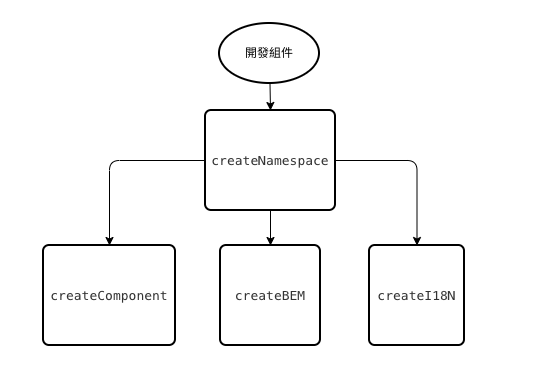

# 開發組件
要開發一個組件時，首先需要調用 `createNamespace` 函式，獲取 `createComponent`、`createBEM` 、 `createI18N` 這三種函式  



## createComponent

## createBEM
由於組件庫的 class name 一般會加上組件庫名稱當前綴，方便辨識與避免與使用者重複命名，這樣導致 class name 通常會比一般項目來的長許多，所以 vant 使用該方法來輕鬆建立符合 BEM 的 class name 。    

```javascript
/**
 * bem 處理範例
 * 
 * b() // 'button'
 * b('text') // 'button__text'
 * b({ disabled }) // 'button button--disabled'
 * b('text', { disabled }) // 'button__text button__text--disabled'
 * b(['disabled', 'primary']) // 'button button--disabled button--primary'
 * 
 */

export function createBEM (name: string){
    return function(el?: Mods,mods?: Mods): Mods{
        // 代表函式傳的第一個參數為修飾符
        if(el && typeof el !== 'string'){
            mods = el
            el = ''
        }

        el = el ? `${name}__${el}` : name
        return `${el}${generate(el,mods)}`
    }
} 
```

PS : `generate` 方法用來處理修飾符( modifier )，且生成最終的 class name。  


## createI18N
調用時會返回一個函式，方便組件調用回傳函式來獲取想要的語系文字。  

```javascript
export function createI18N (name: string){
    const prefix = camelize(name) + '.'
    return function (path: string, ...args: any[]): string{
        const messages = locale.messages()
        const message = get(messages,prefix  + path) || get(messages,path)
        return isFunction(message) ? message(args) : message
    }
}
```

回傳的函式第一個參數用來抓取語言包裡所對應的 key

```
  // 語言包
  pullRefresh: {
    pulling: '下拉即可刷新...',
    loosing: '釋放即可刷新...',
  },
```

```javascript
const t = createI18N('pull-refresh')
t('pulling') // 下拉即可刷新...
```

`...arg` 用來傳遞語言包中使用函式所需要的參數，方便我們可以將文字變成動態顯示

```
 // 語言包
 coupon: {
    unlimited: '無使用門檻',
    discount: (discount: number) => `${discount}折`,
    condition: (condition: number) => `滿${condition}元可用`,
  }
```
```javascript
const t = createI18N('coupon')
t('discount', 1) // 1折
t('condition', 1000) // 滿1000元可用
```
